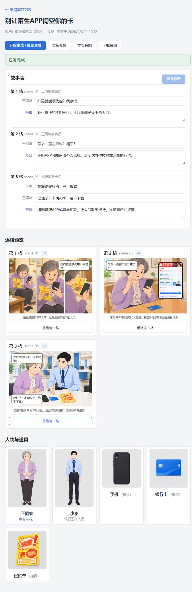
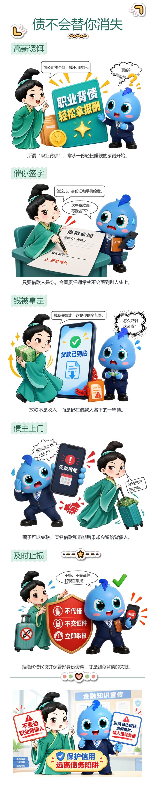

# AI 漫画工坊

把一段文字故事变成一条可以直接发的科普漫画长图。

你给它一个故事主题和几个角色（可以上传自己的卡通形象），它帮你写故事、画分镜、加气泡对话，最后输出一张排版好的长图——就是公众号、小红书常见的那种"一张图看完一个知识点"的形式。

## 效果长这样

左图是工作台：写好故事表，下面就是 AI 生成的分镜，还能逐格修图、拖气泡、改台词。右图是最终导出的成品长图（一个防诈骗科普漫画的例子）：

<table>
<tr>
<td width="45%"></td>
<td width="55%"></td>
</tr>
<tr>
<td align="center"><sub>工作台：故事表 + 分镜预览</sub></td>
<td align="center"><sub>导出的成品长图</sub></td>
</tr>
</table>

## 它是怎么工作的

1. **给主题和角色**：写个故事主题（比如"王阿姨差点被保健品骗局骗了"），上传角色形象或者让 AI 生成
2. **AI 写故事、画分镜**：模型根据主题生成故事表，自动分配台词，然后逐格画图——角色形象会保持一致
3. **人工微调**：画面精修页可以拖气泡、改台词、换字体、加手机屏幕特写、贴贴纸；哪格不满意可以用中文让 AI 重画或局部修改
4. **排版导出**：选一个长图模板（科普卡片、手账风、国风长卷等 17 种），自动生成最终 PNG，也可以导出 PPTX 方便二次编辑

## 能用来干嘛

- 做科普内容（健康、防骗、理财知识漫画）
- 给产品画使用说明漫画
- 做故事绘本、表情包长图
- 任何需要"固定角色 + 讲故事 + 排版好看"的场景

## 跑起来

需要 Python 和一个能画图的大模型服务（OpenAI 或兼容接口）。

```bash
# 1. 装后端依赖
python -m venv .venv
.venv\Scripts\python -m pip install -r requirements.txt   # Windows
# source .venv/bin/activate && pip install -r requirements.txt   # Mac/Linux

# 2. 配 API：项目根目录建 .env，写上
#    OPENAI_API_KEY=你的key
#    OPENAI_BASE_URL=https://你的接口地址

# 3. 起后端（项目根目录）
.venv\Scripts\python -m uvicorn server.api.app:app --port 8000

# 4. 另开终端起前端
cd web
npm install
npm run dev
```

打开 http://127.0.0.1:5173 就能用了。

Windows 上也可以直接跑 `powershell -ExecutionPolicy Bypass -File .\scripts\start-studio.ps1`，脚本会自动起好前后端。

## 技术栈（感兴趣的话）

- 后端：FastAPI，处理故事生成、图片生成调用、气泡文字排版合成
- 前端：React + Vite，画布上的气泡拖拽、长图排版预览
- 画图：走 OpenAI 兼容接口（gpt-image 系列），支持透明背景角色
- 文字：Pillow 做气泡内中文排版，支持自定义字体
- 导出：PNG 长图 + 可编辑文字的 PPTX

## 目录速览

```
server/     后端代码（故事生成、图像处理、排版合成）
web/        前端 React 应用
projects/   你的项目文件（故事、图片、导出结果都在这里）
schemas/    模板、字体、贴纸的配置定义
fonts/      共享字体（思源黑体、思源宋体等 17 款）
scripts/    启动、验证、素材处理脚本
```

---

详细的功能说明和实现细节在 `docs/设计方案-v1.md`。这是个还在持续迭代的项目，功能够用但不完美——欢迎提 issue 或者直接改。
